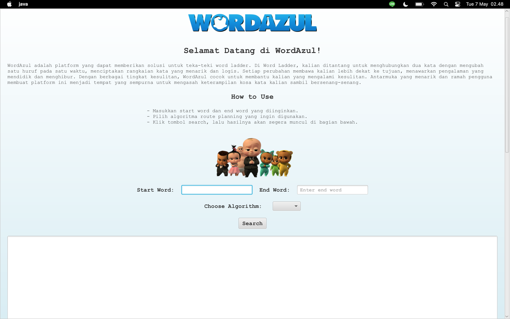
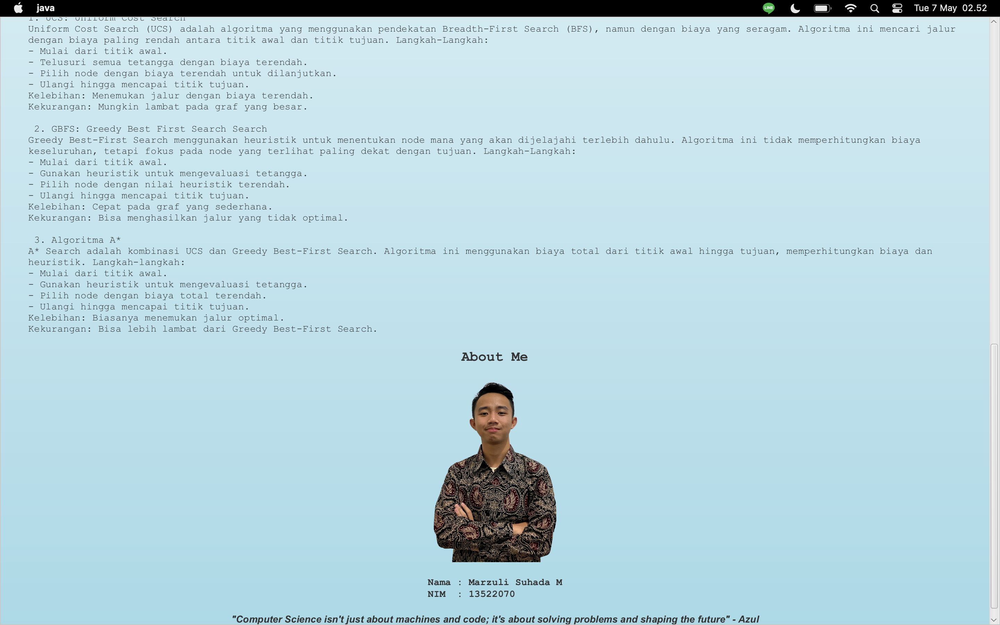

<!-- INTRO -->
<br />
<div align="center">
  <h1 align="center">Tugas Kecil 3 IF2211 Strategi Algoritma Tahun Ajaran 2023/2024</h1>

  <p align="center">
    <h3> Penyelesaian Permainan Word Ladder Menggunakan Algoritma UCS, Greedy Best-First Search, dan A* </h3>
    <p>Program made using Java Language</p>
    <br />
    <a href="https://github.com/zultopia/Tucil3_13522070.git">Report Bug</a>
    ·
    <a href="https://github.com/zultopia/Tucil3_13522070.git">Request Feature</a>
<br>
<br>

[![MIT License][license-shield]][license-url]

  </p>
</div>

<!-- CONTRIBUTOR -->
<div align="center" id="contributor">
  <strong>
    <h3>Dibuat oleh :</h3>
    <table align="center">
      <tr>
        <td>NIM</td>
        <td>Nama</td>
      </tr>
     <tr>
        <td>Marzuli Suhada M</td>
        <td>13522070</td>
    </tr>
    </table>
  </strong>
</div>

## Deskripsi Program

Word ladder adalah permainan kata yang terkenal dimainkan oleh banyak orang. Ditemukan oleh Lewis Carroll pada tahun 1877, permainan ini melibatkan dua kata, yaitu start word dan end word. Pemain harus menemukan rantai kata yang menghubungkan kedua kata tersebut, di mana setiap kata dalam rantai hanya boleh berbeda satu huruf dari kata sebelumnya. Solusi optimal adalah solusi dengan jumlah kata yang dimasukkan ke rantai paling sedikit. 

Program berikut digunakan untuk mencari solusi dari permainan seperti website Word Ladder namun perbedaannya program berikut akan menyajikan 3 algoritma pilihan dalam route planning yaitu UCS, Greedy Best-First Search dan A*. Program ini dibuat dalam bahasa java.

Dokumentasi lengkap tentang program dapat dilihat pada [link berikut](https://docs.google.com/document/d/1tu7SLjJEVwF8sbB8LzhDxNwkIRlGruBIOM_aWvxfHqg/edit)

## About Algorithm

  ### Uniform Cost Search (UCS)
  UCS adalah algoritma pencarian yang menemukan jalur dengan biaya terendah dari titik awal ke tujuan. Dalam konteks Word Ladder, UCS mencari jalur terpendek dengan menghitung biaya setiap transformasi kata. Algoritma ini menggunakan antrian prioritas dan mengunjungi simpul dengan biaya terendah terlebih dahulu, memastikan setiap langkah perubahan kata memiliki biaya yang sama.

  ### Greedy Best-First Search (GBFS)
  GBFS adalah algoritma pencarian yang memprioritaskan simpul berdasarkan estimasi heuristik menuju tujuan. Dalam aplikasi Word Ladder, heuristik biasanya adalah jumlah huruf yang berbeda antara kata saat ini dan kata tujuan. Algoritma ini memilih simpul yang tampaknya paling dekat dengan tujuan, tanpa mempertimbangkan biaya perjalanan yang sebenarnya.

  ### A* 
  A* adalah algoritma pencarian yang menggabungkan pendekatan UCS dan GBFS. Algoritma ini menghitung biaya total (f(n)) dengan menambahkan biaya dari titik awal ke simpul saat ini (g(n)) dan estimasi heuristik menuju tujuan (h(n)). Dalam kasus Word Ladder, A* memberikan jalur terpendek dengan mempertimbangkan jarak dan estimasi menuju tujuan, membuatnya lebih efisien daripada UCS atau GBFS dalam menemukan solusi optimal.

## Spesifikasi Program

```
Tucil3_13522070
 │ 
 ├── bin    
 ├── doc    
 │        └── Tucil3_13522070.pdf 
 ├── img 
 ├── src    
 │       └─ wordladder
 │       	     ├─ dictionary
 │       	     ├─ image
 │       	     ├─ jafafx-sdk-22.0.1
 │       	     ├─ AStar.java
 │       	     ├─ Dictionary.java
 │       	     ├─ GBFS.java
 │       	     ├─ GUI.java
 │       	     ├─ GUI2.java
 │       	     ├─ Main.java
 │       	     ├─ Node.java
 │       	     ├─ Result.java
 │       	     ├─ UCS.java
 │       	     ├─ Utility.java
 │       	     └─ WordDictionary.java
 ├── test    
 └── README.md  
```

## Requirements

To run this program, you need to have:
1. The latest Java version [Java](https://www.java.com/en/)
2. JavaFX compatible with your operating system [JavaFX](https://openjfx.io/)

## Setup and Compilation

### GUI : JavaFX
To install the program with a GUI, ensure JavaFX is installed on your system. If not, you need to install JavaFX. For reference, you can use this [YouTube tutorial](https://www.youtube.com/watch?v=AubJaosfI-0). Follow these steps:

1. Clone this repository:
   ```bash
   git clone https://github.com/zultopia/Tucil3_13522070.git

2. Navigate to the directory of the program:
  ```bash
  cd src/wordladder

3. Compile the program
    #### For Windows
    ```bash
    javac --module-path "<path_to_javafx_sdk for example C:\Java\javafx-sdk-22.0.1>/lib" --add-modules javafx.controls,javafx.fxml,javafx.graphics AStar.java GBFS.java UCS.java WordDictionary.java Node.java Utility.java Result.java GUI.java
    ```

    #### For Linux/MacOS
    ```bash
    java --module-path "<path_to_javafx_sdk for example /Users/azulsuhada/Downloads/javafx-sdk-22.0.1>/lib" --add-modules javafx.controls,javafx.fxml,javafx.graphics GUI
    ```

4. Run the program
    ### For Windows
    ```bash
    javac --module-path "<path_to_javafx_sdk for example C:\Java\javafx-sdk-22.0.1>/lib" --add-modules javafx.controls,javafx.fxml,javafx.graphics AStar.java GBFS.java UCS.java WordDictionary.java Node.java Utility.java Result.java GUI.java
    ```

    #### For Linux/MacOS
    ```bash
    java --module-path "<path_to_javafx_sdk for example /Users/azulsuhada/Downloads/javafx-sdk-22.0.1>/lib" --add-modules javafx.controls,javafx.fxml,javafx.graphics GUI
    ```

### GUI : Java Swing
If JavaFX still not running. Use this alternatif GUI
1. Clone this repository:
   ```bash
   git clone https://github.com/zultopia/Tucil3_13522070.git

2. Navigate to the directory of the program:
  ```bash
  cd src/wordladder

3. Compile the program
    ```bash
    javac AStar.java GBFS.java UCS.java WordDictionary.java Node.java Utility.java Result.java GUI2.java
    ```

4. Run the program
    ```bash
    java GUI2
    ```

### CLI
To run the program with a CLI, follow these steps.
1. Clone this repository
    ```bash
   git clone https://github.com/zultopia/Tucil3_13522070.git

2. Navigate to the src/wordladder directory
    ```bash
    cd ./Tucil3_13522070/src/wordladder

3. Compile and run the program
    ```bash
    javac AStar.java GBFS.java UCS.java WordDictionary.java Node.java Utility.java Result.java Main.java
    java Main

## Screenshoot
<!-- GUI Illustration -->
<div align="center">
  <h2>Graphical User Interface (GUI) Tampak Atas</h2>
  
</div>

<!-- GUI Illustration -->
<div align="center">
  <h2>Graphical User Interface (GUI) Tampak Bawah</h2>
  
</div>

<!-- LICENSE -->
## Licensing

The code in this project is licensed under MIT license.  

<br>
<h3 align="center"> THANK YOU! </h3>

<!-- MARKDOWN LINKS & IMAGES -->
<!-- https://www.markdownguide.org/basic-syntax/#reference-style-links -->
[license-shield]: https://img.shields.io/github/license/othneildrew/Best-README-Template.svg?style=for-the-badge
[license-url]: https://github.com/zultopia/Tucil3_13522070/blob/main/LICENSE